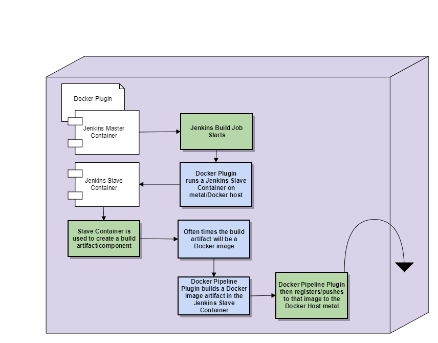

# Docker
cd to the folder containing the `docker-compose.yml` file. In Windows environment, the folder must contain the `.env` file with variable `COMPOSE_CONVERT_WINDOWS_PATHS=1`.
#### Command to run all containers
```
docker-compose up -d
```
#### Command to run a single container (Jenkins)
```
docker-compose up -d jenkins
```
#### Deploying Portainer for docker management
```
docker run -d -p 9000:9000 --restart always -v /var/run/docker.sock:/var/run/docker.sock -v /opt/portainer:/data portainer/portainer
```
#### Jenkins/Docker
